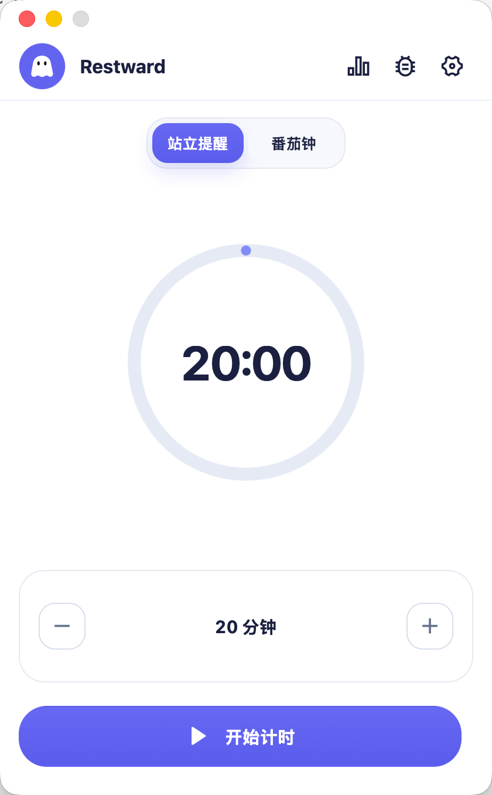
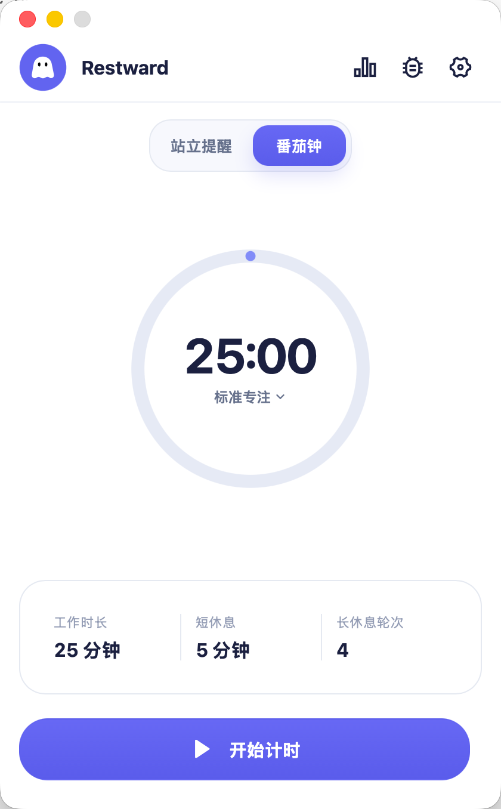
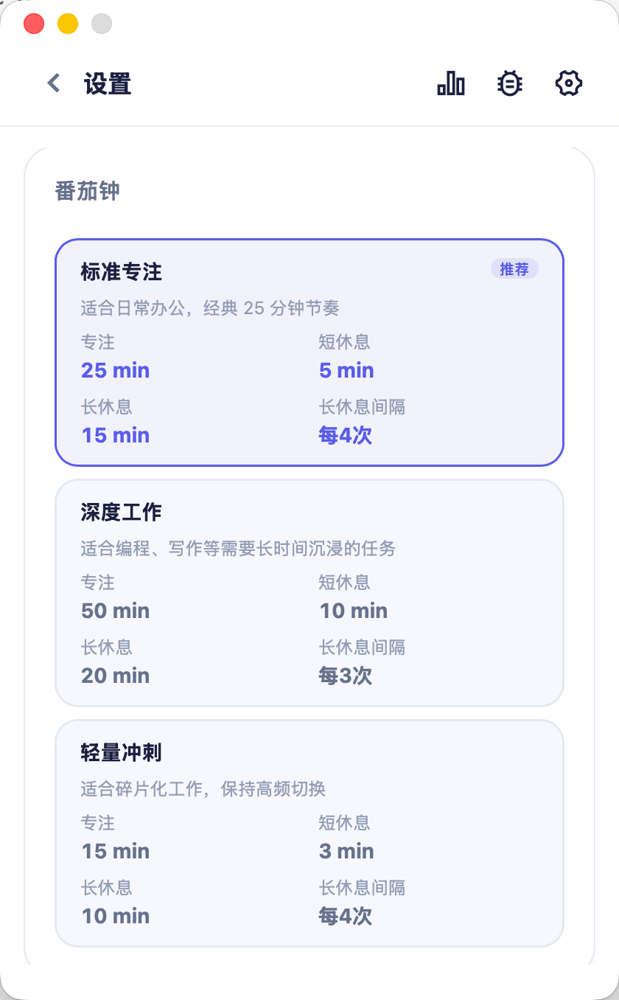
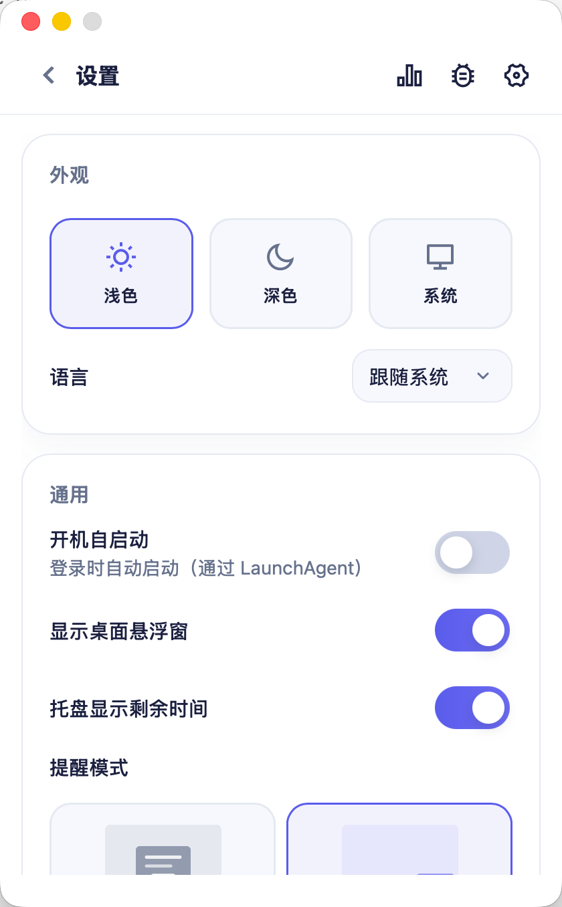
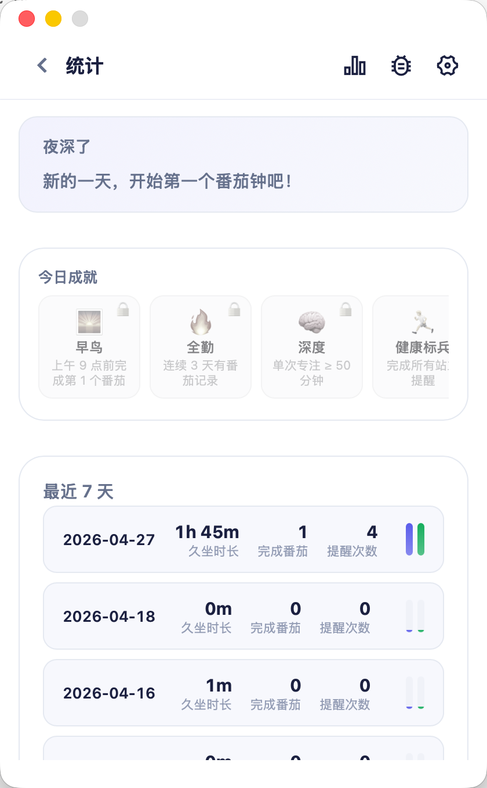

<p align="center">
  
</p>

<h1 align="center">Restward</h1>

<p align="center">
  一款轻量的桌面定时与提醒应用，把<b>站立休息</b>和<b>专注番茄钟</b>装进同一个常驻托盘小工具，<br/>
  帮你在长时间工作中保持节奏、不忘起身。
</p>

<p align="center">
  
  
  
</p>

基于 **Tauri 2** 构建，原生体积小、启动快，常驻系统托盘，到点弹出全屏提醒；支持桌面悬浮窗、浅色 / 深色主题、简体中文与英文。

---

## 截图一览

<table>
  <tr>
    <td align="center"><b>站立提醒</b><br/><sub>到点起身活动</sub></td>
    <td align="center"><b>番茄钟</b><br/><sub>专注 / 休息循环</sub></td>
  </tr>
  <tr>
    <td></td>
    <td></td>
  </tr>
  <tr>
    <td align="center"><b>番茄钟预设</b><br/><sub>标准 / 深度 / 轻量</sub></td>
    <td align="center"><b>设置</b><br/><sub>主题 · 语言 · 自启动</sub></td>
  </tr>
  <tr>
    <td></td>
    <td></td>
  </tr>
  <tr>
    <td colspan="2" align="center"><b>统计</b> — 今日成就 + 最近 7 天数据</td>
  </tr>
  <tr>
    <td colspan="2" align="center"></td>
  </tr>
</table>

---

## 功能特性

### ⏱ 双模式计时

- **站立提醒**：按自定义间隔（默认 20 分钟）提醒你起身活动，减轻久坐带来的腰酸背痛与视疲劳。
- **番茄钟**：经典专注 / 休息循环，内置三档预设：

  | 预设 | 专注 | 短休息 | 长休息 | 长休息间隔 |
  |------|------|--------|--------|------------|
  | **标准专注**（推荐）| 25 min | 5 min | 15 min | 每 4 次 |
  | **深度工作** | 50 min | 10 min | 20 min | 每 3 次 |
  | **轻量冲刺** | 15 min | 3 min | 10 min | 每 4 次 |

### 🔔 到点不打扰，到点必看见

- 全屏覆盖提醒：屏幕中央展示当前应做的事，并附上一条**随机休息动作建议**（颈部拉伸、远眺、起身走动……）。
- 提醒音效可开关。
- 桌面**悬浮窗**：可选在屏幕角落显示迷你倒计时，工作时扫一眼就行，不必频繁切窗。
- 系统**托盘**：左键唤出主窗口，右键菜单快速控制开始 / 暂停 / 重置 / 退出；可选在托盘文字中实时显示剩余时间。

### 📊 本地统计与成就

- **今日成就**：早鸟、全勤、深度、健康标兵等徽章。
- **最近 7 天**：久坐时长、完成番茄数、提醒次数一目了然。
- 所有数据只保存在本地 JSON 文件中，**不会上传任何服务器**。

### 🎨 个性化

- 浅色 / 深色 / 跟随系统主题。
- 简体中文 / English / 跟随系统语言。
- 开机自启动（macOS 通过 LaunchAgent，Windows 通过注册表自启项）。

---

## 下载安装

最新版本请访问 **[Releases](https://github.com/VicZhang6/restward/releases/latest)**。

| 平台 | 下载 |
|------|------|
| **Windows** x64 | NSIS 安装程序（`.exe`） / MSI（中文） |
| **macOS** Apple Silicon | DMG（`aarch64`） |

> **macOS 提示**：安装包**未公证**，首次打开若被系统拦截，请到「系统设置 → 隐私与安全性」点击「仍要打开」，或在终端执行：
>
> ```bash
> xattr -dr com.apple.quarantine /Applications/Restward.app
> ```

---

## 使用小贴士

- 主界面下按 **空格键** = 点击主按钮（开始 / 暂停 / 继续）。
- 点击**圆形进度条上方的小圆点**可拖动调整时长（站立提醒模式）。
- 番茄钟模式下，点击数字下方的「标准专注 ⌄」可快速切换预设。
- 设置页可关闭悬浮窗 / 托盘剩余时间，让 Restward 更隐身。

---

## 技术栈

| 组件 | 用途 |
|------|------|
| **Tauri 2** | 桌面壳、托盘、多窗口、自启动 |
| **Vite 8** | 多 HTML 入口的前端打包 |
| **原生 HTML / CSS / JS** | UI 与业务逻辑（无框架） |
| **本地 JSON Store** | settings / runtime / stats 三份本地数据 |

---

## 版权说明

本仓库**非开源**，源代码不以 MIT 等开源协议发布。著作权与使用限制见根目录 **[LICENSE](LICENSE)**。

---

**作者**：Vic Zhang · 反馈 & Bug：[Issues](https://github.com/VicZhang6/restward/issues)
